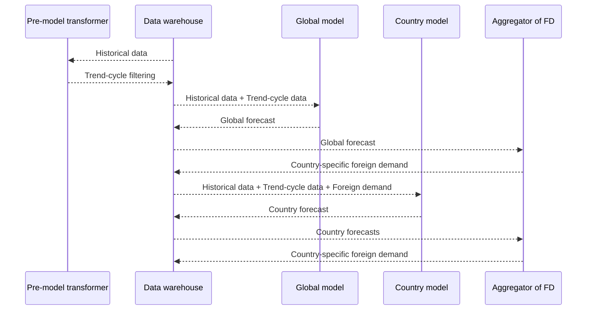

# Big picture of forecast workflow

```mermaid
sequenceDiagram
    participant PREM as Pre-model transformer
    participant DWH as Data warehouse
    participant GLOB as Global model
    participant CTRY as Country model
    participant AGGR as Aggregator of FD

    DWH -->> PREM: Historical data
    PREM -->> DWH: Trend-cycle filtering

    DWH -->> GLOB: Historical data + Trend-cycle data
    GLOB -->> DWH: Global forecast

    DWH -->> AGGR: Global forecast
    AGGR -->> DWH: Country-specific foreign demand

    DWH -->> CTRY: Historical data + Trend-cycle data + Foreign demand
    CTRY -->> DWH: Country forecast

    DWH -->> AGGR: Country forecasts
    AGGR -->> DWH: Country-specific foreign demand
```
