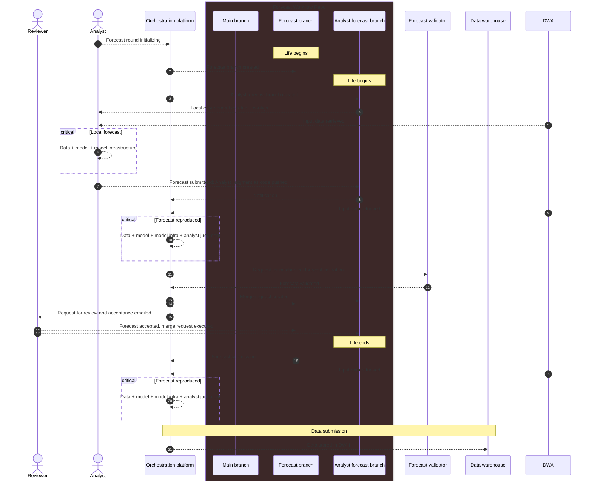
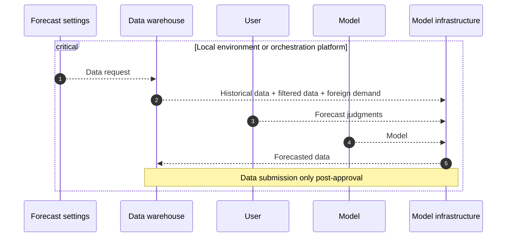

# Forecast workflow

## Orchestration diagram

```mermaid
sequenceDiagram
	actor REV as Reviewer
	actor USA as Analyst
	participant ORC as Orchestration platform
        box rgb(60,40,40) Forecast Workflow Repo
        	participant WKM as Main branch
		participant WKF as Forecast branch
		participant WKA as Analyst forecast branch
	end
	participant USC as Forecast validator
        participant DWH as Data warehouse
	

	autonumber

		USA -->> ORC: Forecast round initializing
                Note over WKF: Life begins
		ORC -->> WKF: Forecast branch created
		Note over WKA: Life begins
		ORC -->> WKA: Analyst forecast branch created
		WKA -->> USA: Local environment created + configs
                DWA -->> USA: Input data retrieved
		critical Local forecast
			USA -->> USA: Data + model + model infrastructure
		end

		USA -->> WKA: Forecast submittecd: Analyst judgment as code pushed
                WKA -->> ORC: Notification
                DWA -->> ORC: Input data retrieved
                critical Forecast reproduced
                         ORC -->> ORC: Data + model + model infra + analyst judgment
                end
                ORC -->> USC: Request for mechanical forecast validation
                USC -->> ORC: Forecast validated
                ORC -->> WKA: Merge request created
	        ORC -->> WKF:  
                ORC -->> REV: Request for review and acceptance emailed
		REV -->> WKF: Forecast accepted, merge request executed
                REV -->> WKA:  
                Note over WKA: Life ends
		WKF -->> ORC: Forecast submission
                DWA -->> ORC: Input data retrieved
                critical Forecast reproduced
                         ORC -->> ORC: Data + model + model infra + analyst judgment
                end
		Note over ORC, DWH: Data submission
                ORC -->> DWH: Data stored in DWH
```

## Data-producing diagram

```mermaid
sequenceDiagram
	participant WRK as Forecast settings
	participant DWH as Data warehouse
	participant USR as User
	participant MOD as Model
	participant INF as Model infrastructure

	autonumber

    critical Local environment or orchestration platform
		WRK -->> DWH: Data request
		DWH -->> INF: Historical data + filtered data + foreign demand
		USR -->> INF: Forecast judgments
		MOD -->> INF: Model
		INF -->> DWH: Forecasted data
		Note over INF, DWH: Data submission only post-approval
    end
```

## Local environment dependencies

* Matlab R2021b or later
* Python 3.11 with the `requests` package installed
