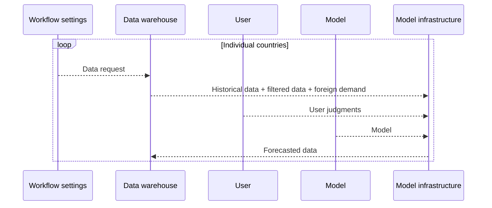

# Forecast workflow

## Sequence diagram

```mermaid
sequenceDiagram
	participant WKF as Workflow settings
	participant DWH as Data warehouse
	participant USR as User
	participant MOD as Model
	participant INF as Model infrastructure

    loop Individual countries
        WKF -->> DWH: Data request
        DWH -->> INF: Historical data + filtered data + foreign demand
        USR -->> INF: User judgments
        MOD -->> INF: Model
        INF -->> DWH: Forecasted data
    end
```
