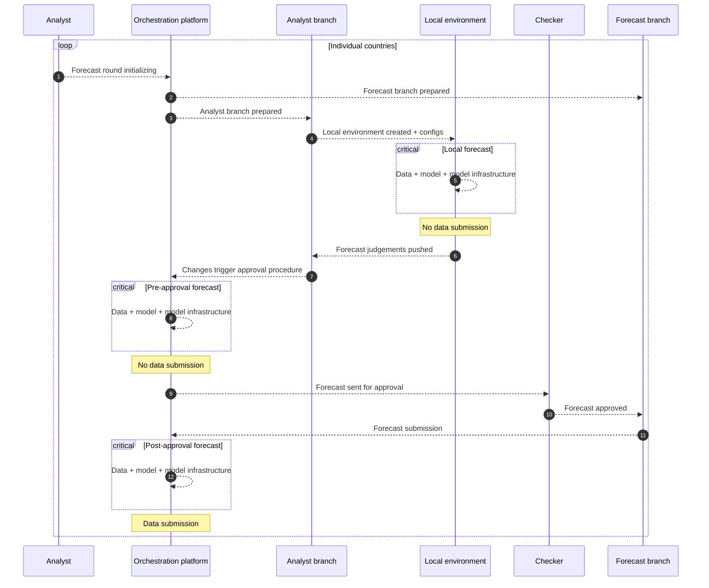
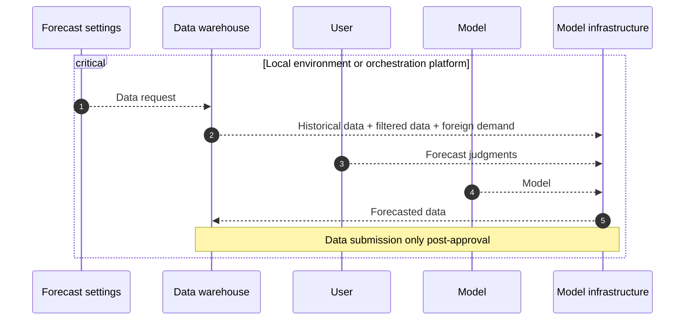

# Forecast workflow

## Orchestration diagram

```mermaid
sequenceDiagram
	participant USA as Analyst
	participant ORC as Orchestration platform
	participant WKA as Analyst branch
	participant LOC as Local environment
	participant USC as Checker
	participant WKF as Forecast branch

	autonumber

    loop Individual countries
		USA -->> ORC: Forecast round initializing
		ORC -->> WKF: Forecast branch prepared
		ORC -->> WKA: Analyst branch prepared
		WKA -->> LOC: Local environment created + configs
		critical Local forecast
			LOC -->> LOC: Data + model + model infrastructure
		end
		Note over LOC, LOC: No data submission

		LOC -->> WKA: Forecast judgements pushed
		WKA -->> ORC: Changes trigger approval procedure
		critical Pre-approval forecast
			ORC -->> ORC: Data + model + model infrastructure
		end
		Note over ORC, ORC: No data submission
		ORC -->> USC: Forecast sent for approval
		USC -->> WKF: Forecast approved
		WKF -->> ORC: Forecast submission
		critical Post-approval forecast
			ORC -->> ORC: Data + model + model infrastructure
		end
		Note over ORC, ORC: Data submission
    end
```

## Data-producing diagram

```mermaid
sequenceDiagram
	participant WRK as Forecast settings
	participant DWH as Data warehouse
	participant USR as User
	participant MOD as Model
	participant INF as Model infrastructure

	autonumber

    critical Local environment or orchestration platform
		WRK -->> DWH: Data request
		DWH -->> INF: Historical data + filtered data + foreign demand
		USR -->> INF: Forecast judgments
		MOD -->> INF: Model
		INF -->> DWH: Forecasted data
		Note over INF, DWH: Data submission only post-approval
    end
```
