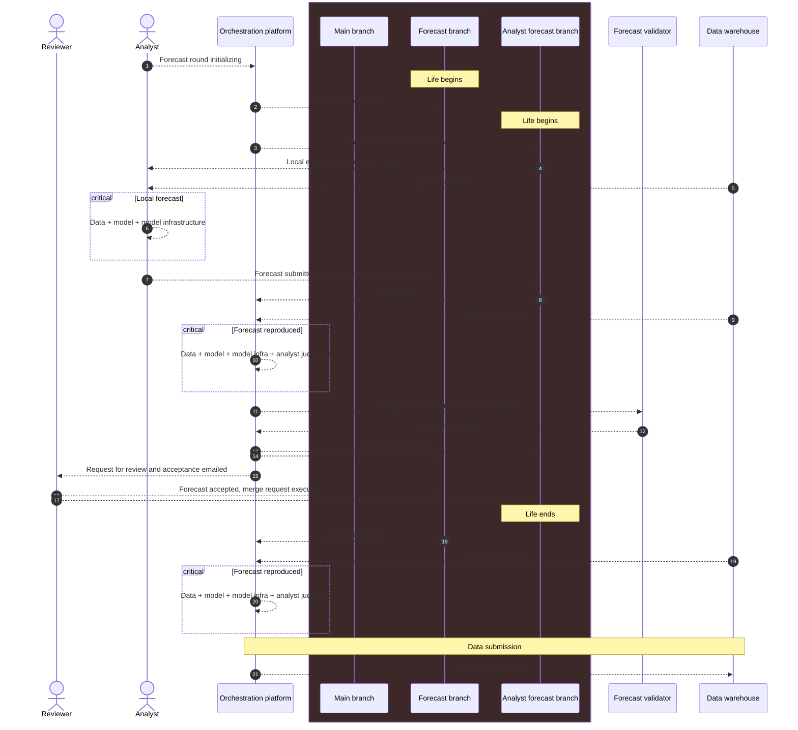
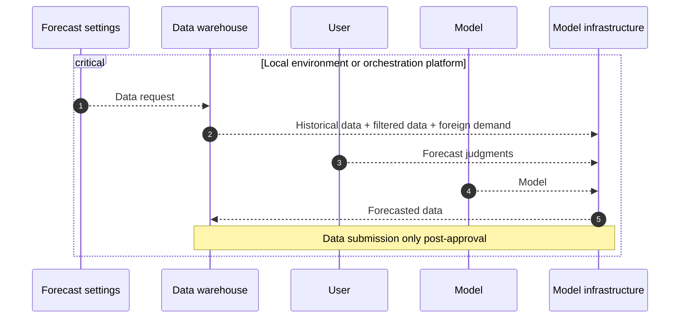

# Forecast workflow


## Orchestration diagram



## Data-producing diagram




---

## Local environment dependencies

* Git (latest or any fairly recent)
* Matlab R2021b or later
* Python 3.11 with the `requests` package installed
* Access to the OGR-EIU repositories on GitHub - either SSH (more convenient) or PAT (easier)

---

## Set up the local environment manually

1. Create a `forecast` folder within which all dependencies will be cloned/installed next to each other. At the end of the setup process, the resulting structure should look like this:

```
local-forecast
|
|-- workflow-forecast
|
|-- model-cz
|
|-- model-infra
|
|-- toolset
|
|-- data-warehouse-client
|
|-- iris-toolbox
```

2. After creating the `local-forecast` folder, while being inside the `local-forecast` folder, clone the following OGR-EIU repositories


```
git clone https://github.com/OGR-EIU/workflow-forecast
git clone https://github.com/OGR-EIU/model-cz
git clone https://github.com/OGR-EIU/model-infra
git clone https://github.com/OGR-EIU/toolset
git clone https://github.com/OGR-EIU/data-warehouse-client
```

If you only have PAT based access, include your PAT as a string in the URL, e.g. 

```
git clone https://XXXXXXXXXXXXXXXXX@github.com/OGR-EIU/workflow-forecast
```

where `XXXXXXXXXXXXXXXXX` is your PAT. Mind the extra `@` inserted between the PAT and the rest of the URL.


3. Finally, clone the Iris Toolbox (public access, no SSH or PAT needed)

```
git clone https://github.com/IRIS-Solutins-Team/IRIS-Toolbox iris-toolbox
```


