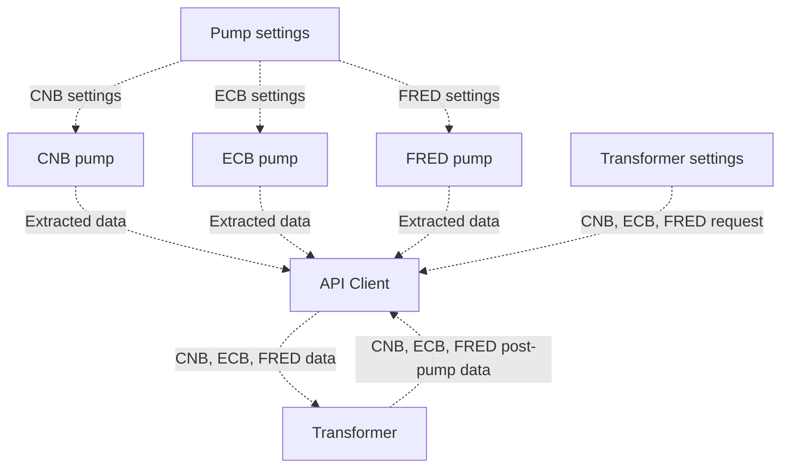

# Pump workflow

```mermaid
flowchart TD
	WKP[Pump settings] -.CNB settings.-> CNB[CNB pump] -.Extracted data.-> API[API Client]
	WKP[Pump settings] -.ECB settings.-> ECB[ECB pump] -.Extracted data.-> API[API Client]
	WKP[Pump settings] -.FRED settings.-> FRD[FRED pump] -.Extracted data.-> API[API Client]
	
	WKT[Transformer settings] -.CNB, ECB, FRED request.-> API[API Client] -.CNB, ECB, FRED data.-> TRN[Transformer]
	TRN[Transformer] -.CNB, ECB, FRED post-pump data.-> API[API Client]
```
