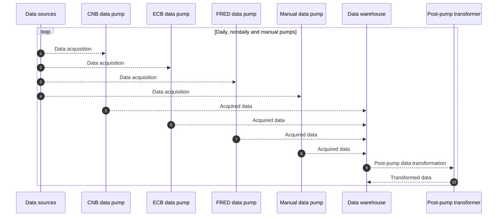
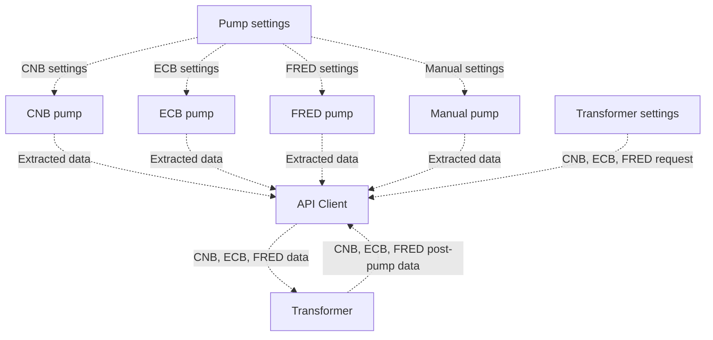

# Pump workflow

## Sequence diagram

```mermaid
sequenceDiagram
	participant SRC as Data sources
	participant CNBP as CNB data pump
	participant ECBP as ECB data pump
	participant FRDP as FRED data pump
	participant MANP as Manual data pump
	participant DWH as Data warehouse
	participant TRAN as Post-pump transformer

	autonumber

    loop Daily, nondaily and manual pumps
        SRC -->> CNBP: Data acquisition
        SRC -->> ECBP: Data acquisition
        SRC -->> FRDP: Data acquisition
        SRC -->> MANP: Data acquisition
        CNBP -->> DWH: Acquired data
        ECBP -->> DWH: Acquired data
        FRDP -->> DWH: Acquired data
        MANP -->> DWH: Acquired data
        DWH -->> TRAN: Post-pump data transformation
        TRAN -->> DWH: Transformed data
    end
```

## Flowchart

```mermaid
flowchart TD
	WKP[Pump settings] -.CNB settings.-> CNB[CNB pump] -.Extracted data.-> API[API Client]
	WKP[Pump settings] -.ECB settings.-> ECB[ECB pump] -.Extracted data.-> API[API Client]
	WKP[Pump settings] -.FRED settings.-> FRD[FRED pump] -.Extracted data.-> API[API Client]
	WKP[Pump settings] -.Manual settings.-> MAN[Manual pump] -.Extracted data.-> API[API Client]
	
	WKT[Transformer settings] -.CNB, ECB, FRED request.-> API[API Client] -.CNB, ECB, FRED data.-> TRN[Transformer]
	TRN[Transformer] -.CNB, ECB, FRED post-pump data.-> API[API Client]
```
